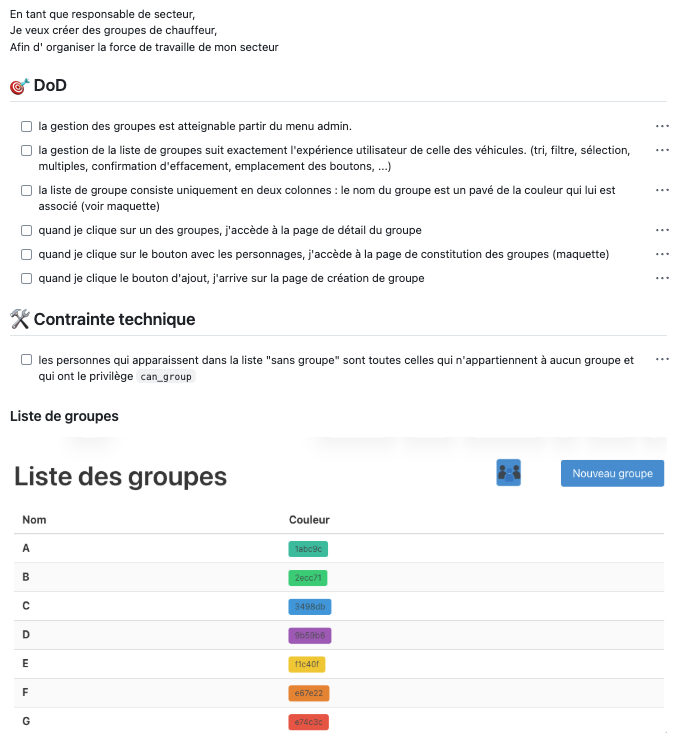

# User Stories
Ce document décrit la manière d'utiliser des User Stories dans le cadre de notre projet de développement.

Une User Story est une description simple dʼun besoin, exprimée par un utilisateur, pour déterminer les
fonctionnalités à développer. Elle vise une fonctionnalité précise et décrit comment l'utilisateur interagira
avec le système une fois celui-ci terminé

Une User Story possède un titre (court), qui permet de la distinguer des autres sans risque de se tromper.

Elle s'articule ensuite en trois ou quatre parties: Description, Tests d'acceptance, Support graphique.

## Description
La description énonce le besoin lui-même, mais aussi qui a ce besoin et avec quelle intention.  
On utilise généralement la structure suivante pour formuler la description:

> En tant que …
> Je veux …
> Pour …

Ne soyons pas dogmatiques, cette structure nʼa pas besoin dʼêtre conservée à la lettre ! Elle doit servir
avant tout de rappel à ce qui doit figurer dans la story: qui est concerné, quelle est la fonctionnalité, à quoi sert-elle ?

#### Exemple ‘à la lettreʼ :
> En tant qu'utilisateur,
> je veux m'authentifier auprès du système
> pour pouvoir accéder à mes données.

#### Variante 1, où on considère lʼintention du login comme évidente:

> En tant qu'utilisateur,
> je veux m'authentifier auprès du système

#### Variante 2, où on n'utilisa pas la structure "En tant que ..." :
> Les utilisateurs peuvent s'authentifier sur le système

## Tests d'acceptance
Les tests d'acceptance sont le résultat de l'analyse fonctionnelle de la story. Ce sont eux qui décrivent
comment le système va fonctionner pour répondre aux attentes du client. Mis bout à bout, ils racontent
comment le système se comporte quand l'utilisateur agit sur lui (d'où le terme de "user story").  
Commençons par une définition utile ici (mais pas que):

> Une assertion est une phrase qui dit quelque chose que l'on soutient comme vrai

Exemple d'assertion: "Je suis rentré chez moi avant minuit hier soir"

Un test d'acceptance dans le contexte d'une user story est une assertion concernant le système fini. On
s'imagine qu'on a terminé le développement de notre produit et on formule une assertion au sujet d'un
utilisateur en train de l'utiliser

Exemple: "Dans ma page de profil, quand je clique sur ma photo de profil, elle s'agrandit pour prendre tout
l'espace disponible."

Un test d'acceptance bien formulé ne laisse aucune place au doute concernant trois éléments:
1. Le contexte de départ dans lequel l'utilisateur doit se trouver
2. L'action effectuée par l'utilisateur
3. Le résultat de cette action

Pour vous assurer que votre test est bien formulé, passez-le en revue avec l'acronyme SMAAAR, un proche cousin de SMART que vous connaissez certainement:

| Terme          | Qui veut dire                                                                                       |
| -------------- | --------------------------------------------------------------------------------------------------- |
| **S**pécifique | Précis, non ambigu. Il n'y a pas de place pour l'interprétation. Cela n'adresse qu'une seule chose. |
| **M**esurable  | Dans ce contexte, on va même plus loin: le résultat de la mesure doit être vrai ou faux             |
| **A**cceptable | Cela ne va pas à l'encontre de règles en vigueur, de la morale ou de l'éthique professionnelle      |
| **A**mbitieux  | La réalisation de cette chose va être un apport de valeur significatif                              |
| **A**dapté     | Cela sert le(s) but(s) de notre projet                                                              |
| **R**éaliste   | C'est quelque chose de faisable, de raisonnable                                                     |

Attention: il doit s'agir de quelque chose que l'utilisateur peut constater.

#### Exemple correct: 
Dans la page d'édition, quand je clique "sauver", un message de confirmation de l'enregistrement apparaît durant 3 secondes

#### Exemple incorrect: 
Dans la page d'édition, quand je clique "sauver", les données sont stockées dans la base de données"

### Astuces pour vous simplifier l'écriture des tests:
- On peut faire référence à des maquettes, autant pour le contexte que pour le résultat. Cela vous économisera beaucoup de texte
- Mettez-vous à la place de l'utilisateur final et rédigez vos tests en "je" ! C'est plus facile à écrire
- Une user story est complète et prête à être codée quand elle a (en général) avoir entre 2 et 10 tests d'acceptance. 
  Pourquoi ces chiffres ? parce que s'il n'y a qu'un test, cela veut dire que la story est trop petite (=pas ambitieuse) et si elle en a plus que 10, elle est probablement trop complexe.

**--- ATTENTION ---**

Il est de la plus haute importance de valider les tests d'acceptance avec le client avant d'aller plus loin !!!

Si vous ne le faites pas, vous courez le risque de faire un travail inutile.

## Support graphique

Pour simplifier, l'expression des tests d'acceptance, il est fortement recommandé d'avoir recours à un support graphique tel que: maquette, schéma d'architecture, diagramme d'État, MCD, diagramme de séquence, ...

Le texte du test d'acceptance doit ensuite faire référence de manière précise à ces éléments graphiques. Il est donc indispensable que ces derniers se trouvent à proximité du test d'acceptance.

#### Exemple:

